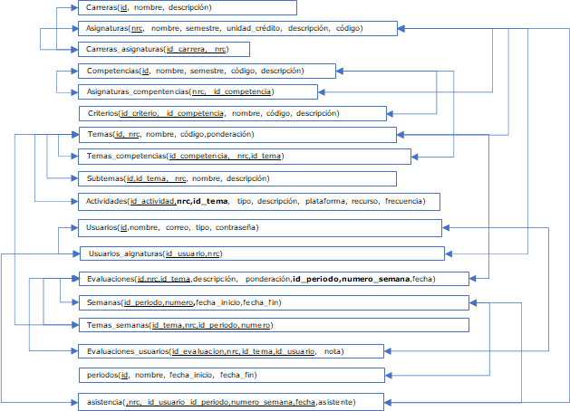
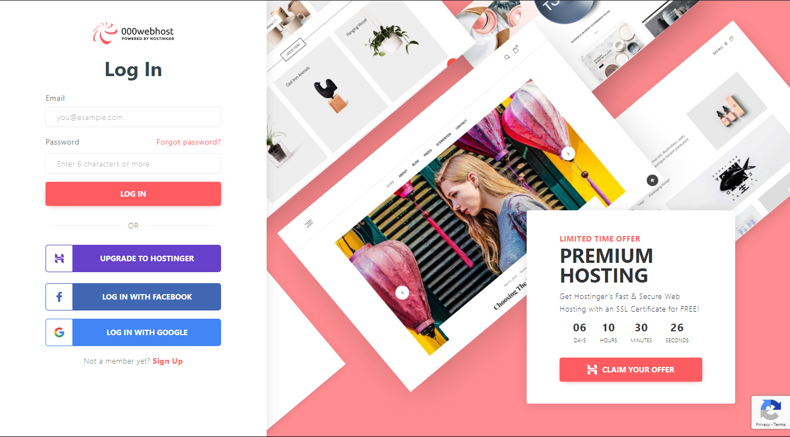
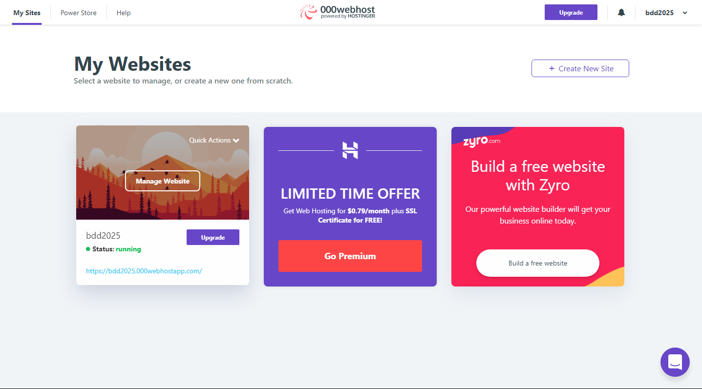
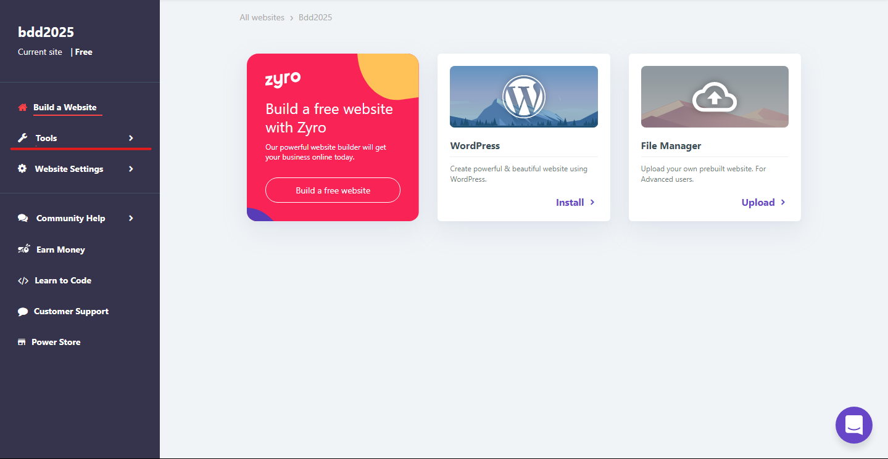
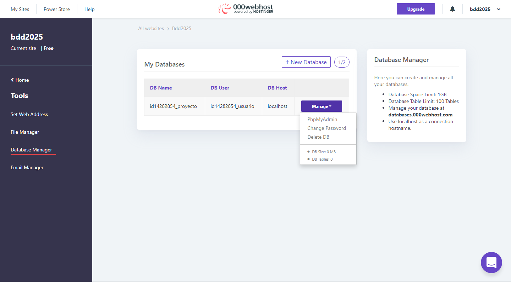

# Proyecto de Base de datos semestre Marzo/2020

### Integrantes / Desarrolladores

- Felix Lopez, CI: 26649762
- Andrea Torres, CI: 26939783

## Grafo Relacional de la base de datos

## Pasos para conectarse al PhpMyAdmin de 000webhost.com

### Paso 1 - Ir a la pagina de [000webhost](https://www.000webhost.com/cpanel-login?from=panel)

### Paso 2 - Ingresar Crendenciales

- Correo: bdd2025@gmail.com
- Contrañesa: DCTm>j)jc}1

### Paso 3 - Seguir la ruta Manage Website > Tools > Database Manager > PhpMyAdmin

### Informacion adicional

- Nombre base de datos: proyecto
- Usuario: usuario
- Contraseña: -7FBbvVrp-UyoD4p
